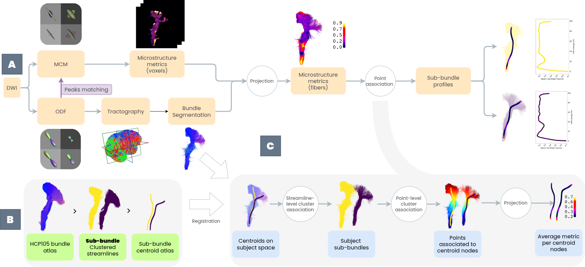
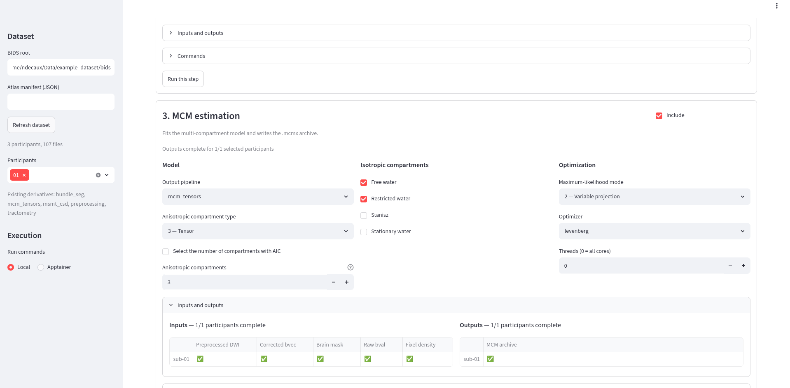

# TractoPL



TractoPL is a diffusion MRI processing package that focus on Multi compartment models and tractometry. It is part of a collection of other tools that makes diffusion image processing and analysis easier :

- [TractoPL](https://github.com/nathandecaux/TractoPL) : collection of helpers, scripts, and dashboard for tractometry, from the DWI to population-level bundle profile analysis.

<!-- - [Pybides](https://github.com/nathandecaux/PyBides) : Lightweight, dependency-friendly helpers to browse, query, and write BIDS-like datasets without requiring a full BIDS indexer. -->

- [TractViewer](https://github.com/nathandecaux/TractViewer) : A simple utility based on PyVista for viewing and capturing tractography, surfaces, and volumes.
- [HCP105 bundle templates](https://zenodo.org/records/22641462) :  Utilities for bringing the **HCP105 white-matter reference tract** dataset into a shared atlas space and creating bundle-wise tractogram templates.

TractoPL is a diffusion MRI processing package for BIDS datasets. It writes each processing stage to `derivatives/<pipeline>/` and uses BIDS entities to find inputs and name outputs consistently. The supported end-to-end workflow is preprocessing, FOD/tractography, MCM fitting and projection, bundle segmentation, and tractometry.

## Installation

Install the package in an isolated environment:

```shell
git clone https://github.com/nathandecaux/TractoPL.git
cd TractoPL
pip install .
```

TractoPL calls external neuroimaging programs. Install and configure Anima, MRtrix3, ANTs, TractSeg, and FSL before running the relevant steps. These tools are not installed by `pip`. Set their locations with `TRACTOPL_ANIMA_DIR`, `TRACTOPL_ANIMA_DATA_DIR`, `TRACTOPL_ANIMA_SCRIPTS_DIR`, `TRACTOPL_ANIMA_PRIVATE_SCRIPTS_DIR`, `TRACTOPL_TRACTSEG_DIR`, and `TRACTOPL_MRTRIX_DIR`. Legacy Anima and TractSeg configuration files are still recognized as a fallback.

Run `tractopl-preprocessing --help` or any other command with `--help` to inspect its arguments.

## Prepare a Dataset

Pass the BIDS root explicitly to every command with `--db-root`. You can also set `TRACTOPL_DATASET_ROOT` for Python API use. TractoPL never selects a local dataset automatically.

The initial input for one participant is a BIDS DWI image with matching `.bval` and `.bvec` files. Existing BIDS derivatives can stay where they are: `Dataset` indexes raw and derivative files together, `Subject` selects files by their entities, and `BIDSFile` retains the entities needed to write new outputs.

```python
from TractoPL.data.loader import Dataset

dataset = Dataset("/data/my-bids-dataset")
print(dataset.describe())
subject = dataset.get_subject("01")
```

Use `Dataset.describe()` before processing to check the detected participants, files, and derivative pipelines.

## Prepare an Atlas

Bundle segmentation and tractometry need an atlas manifest. Copy [atlas_manifest.example.json](TractoPL/config_profiles/atlas_manifest.example.json) next to an atlas and update its paths. The required keys are `name`, `reference`, and `bundles_dir`; paths relative to the manifest are supported. `centroids_dir`, `parcellations_dir`, and `bundle_mapping` are used only by steps that need them.

To use HCP105, download the atlas from [Zenodo](https://zenodo.org/records/1477956), apply the published templating procedure, and create a manifest that points to the resulting reference image, bundle templates, and centroids. The optional `[hcp105_legacy.json](TractoPL/config_profiles/hcp105_legacy.json)` profile can be used as `bundle_mapping` to retain historical HCP names. Custom bundle names are supported and must not contain underscores.

## Processing Workflow

The example script runs the supported workflow for one participant. It requires the BIDS root, atlas manifest, and participant identifier:

```shell
bash examples/run_workflow.sh /data/my-bids-dataset /data/my-atlas/atlas.json 01
```

The script runs :

- preprocessing,
- creates FODs/fixels and an iFOD2 tractogram,
- fits MCM,
- segments bundles from whole-brain tractograms,
- projects MCM metrics onto those bundles,
- and writes tractometry CSV files.

## Apptainer

An Apptainer definition is available at [apptainer/TractoPL.def](apptainer/TractoPL.def). It packages all the required tools for running TractoPL, including Anima 4.2, MRtrix3 from Conda, and ANTs.

<!-- T
ractoPL, Anima 4.2, MRtrix3 from Conda, and ANTs. Both Apptainer recipes download the official Anima 4.2 Ubuntu binaries from the [Anima-Public releases](https://github.com/Inria-Empenn/Anima-Public/releases/tag/v4.2) and clone the `Anima-Scripts-Public` and `Anima-Scripts-Data-Public` repositories during the build, so no local Anima checkout is required on the build host — only network access to GitHub. The image deliberately does not include a BIDS dataset, an atlas, bundle templates, or centroids.  -->

Build the image from the repository root. The command normally requires access
to a privileged Apptainer build service or a configured `--fakeroot` setup.
Apptainer stages the build's temporary sandbox under `$APPTAINER_TMPDIR`
(defaulting to `/tmp`); on hosts where `/tmp` is a small or quota-limited
tmpfs, point it at a directory on real disk with a few GB free to avoid a
`Disk quota exceeded` error mid-build:

<!-- ```shell
export APPTAINER_TMPDIR=/path/to/scratch/dir  # e.g. /home/$USER/apptainer-tmp
mkdir -p "$APPTAINER_TMPDIR"
apptainer build --fakeroot tractopl.sif apptainer/TractoPL.def
```

Run the complete workflow while keeping the dataset, atlas, and TractoSearch installation on the host:

```shell
bash examples/run_workflow_apptainer.sh \
  tractopl.sif \
  /data/my-bids-dataset \
  /data/my-atlas/atlas.json \
  01
```

The launcher binds every supplied directory at the same absolute path inside the container. This keeps relative paths in an atlas manifest valid and writes derivatives directly to the host BIDS root. -->

[apptainer/TractoPL.def](apptainer/TractoPL.def) builds the same tool runtime without copying or installing this repository. It is intended for development: the local checkout is mounted at runtime, so Python changes are used immediately and rebuilding the image is unnecessary.

```shell
export APPTAINER_TMPDIR=/path/to/scratch/dir  # e.g. /home/$USER/apptainer-tmp
mkdir -p "$APPTAINER_TMPDIR"
apptainer build --fakeroot tractopl.sif apptainer/TractoPL.def
bash examples/run_workflow_apptainer.sh \
  tractopl.sif \
  "$PWD" \
  /data/my-bids-dataset \
  /data/my-atlas/atlas.json \
  01
```

The launcher mounts the checkout at `/opt/tractopl`, sets `PYTHONPATH=/opt/tractopl`, and invokes the mounted `examples/run_workflow.sh`. The image provides `tractopl-preprocessing`, `tractopl-msmt-csd`, `tractopl-mcm`, `tractopl-bundle-seg`, `tractopl-tractometry`, `tractopl-connectome`, `tractopl-generate-centroid`, `tractopl-frechet-clustering`, `tractopl-apply-trans-to-vtk`, `tractopl-convert-tractogram`, and `tractopl-population-analysis` wrappers that load modules from this checkout. Changes to packaging metadata or Python dependencies still require rebuilding the development image.

## Quick start

Use the workflow launcher using streamlit : 

```Shell
streamlit run streamlit_launcher.py
```

It detects your dataset, retrieve the right files for each individual subjects, let you run the workflow step by step, and gives you a feedback on the success of the pipeline. 



## Command-Line Tools

The package installs the following maintained commands:

| Command                          | Purpose                                                 |
| -------------------------------- | ------------------------------------------------------- |
| `tractopl-preprocessing`       | Preprocess DWI, fit DTI, and compute FA.                |
| `tractopl-msmt-csd`            | Generate responses, FODs, fixels, and tractography.     |
| `tractopl-mcm`                 | Fit MCM or project MCM metrics onto bundle tractograms. |
| `tractopl-bundle-seg`          | Register the atlas and segment bundles.                 |
| `tractopl-tractometry`         | Associate metrics to centroids or combine CSV files.    |
| `tractopl-connectome`          | Compute bundle density metrics.                         |
| `tractopl-generate-centroid`   | Generate a centroid VTK from one tractogram.            |
| `tractopl-frechet-clustering`  | Generate centroid clusters with Fréchet distances.     |
| `tractopl-apply-trans-to-vtk`  | Apply a transform to a VTK tractogram.                  |
| `tractopl-convert-tractogram`  | Convert a tractogram format.                            |
| `tractopl-population-analysis` | Perform population-level analysis on tractometry data.  |

Typical commands for one participant are:

```shell
tractopl-preprocessing --subject 01 --db-root /data/my-bids-dataset
tractopl-msmt-csd --subject 01 --db-root /data/my-bids-dataset \
  --step response --step fod --step fixels --step fixels2peaks --step ifod2_tracto
tractopl-mcm estimation --subject 01 --db-root /data/my-bids-dataset
tractopl-bundle-seg segmentation --subject 01 --db-root /data/my-bids-dataset \
  --atlas /data/my-atlas/atlas.json
tractopl-mcm projection --subject 01 --db-root /data/my-bids-dataset \
  --bundle-pipeline bundle_seg
tractopl-tractometry association --subject 01 --db-root /data/my-bids-dataset \
  --atlas /data/my-atlas/atlas.json --mcm-pipeline mcm_tensors --bundle-pipeline bundle_seg
```

MCM uses peak/fixel density when it is available. Use `--n-comparts` to fit a fixed number of anisotropic compartments, or `--model-selection` to use AIC. The historical maximum-likelihood mode and Levenberg optimizer remain the defaults. Tractometry reads bundle names from BIDS derivative entities instead of imposing an HCP list. Use `tractopl-tractometry combine-csv` to create TractSeg-style metric CSV files from an existing tractometry derivative.

## Workflow Launcher

A Streamlit page builds and runs the commands above from the browser:

```shell
pip install '.[dashboard]'
streamlit run TractoPL/dashboard/streamlit_launcher.py
```

Enter the BIDS root and atlas manifest in the sidebar. The launcher indexes the
dataset with `Dataset`, lists the detected participants, and offers the existing
derivative pipelines wherever a step needs one.

Each workflow step gets its own block with its options, the exact command lines
it will run for the selected participants, and a button to run that step alone.
`Run the included steps` runs every checked block in order and stops at the
first failure.

Each block also shows, per participant, which of its inputs and expected outputs
exist in the dataset. Outputs of one step are the inputs of the next ones, so
the tables show where a participant stopped. After each command the launcher
re-indexes the dataset and treats missing outputs as a failure, because some
commands report errors without a non-zero exit code.

To run inside Apptainer, select `Apptainer` under `Execution`, choose the `.sif`
image and the TractoPL checkout, and press `Load image`. Loading checks that the
image imports TractoPL from the mounted checkout and provides the `tractopl-*`
commands. Commands then run with `apptainer exec`, binding the dataset and atlas
directories at the same path and the checkout at `/opt/tractopl`, as in
`examples/run_workflow_apptainer.sh`.

## Dashboard and AFQ Analysis

Install the optional dashboard dependencies and start Streamlit:

```shell
pip install '.[dashboard]'
streamlit run TractoPL/dashboard/streamlit_dashboard.py
```

Select the BIDS root in the sidebar, or provide `TRACTOPL_DATASET_ROOT`. The dashboard identifies tractometry derivatives through the `.tag_tractometry` marker written by `tractopl-tractometry`, their BIDS `dataset_description.json`, or existing metric CSV files. This makes custom `--pipeline` names discoverable; legacy `hcp_association*` names remain recognized.

AFQ analysis uses JSON configuration. Start from [population_analysis_example_config.json](TractoPL/analysis/population_analysis_example_config.json), set `dataset` to an existing BIDS root, and set `hcp_asso_pipeline` to the tractometry derivative name:

```shell
tractopl-population-analysis -c analysis_config.json \
  --subjects-table /data/my-bids-dataset/participants.xlsx \
  --output-dir /data/my-bids-dataset/derivatives/population_analysis
```

The participant table and output directory are optional. A missing or invalid configuration, or the `/PATH/TO/DATASET` placeholder, is rejected before an analysis starts.
